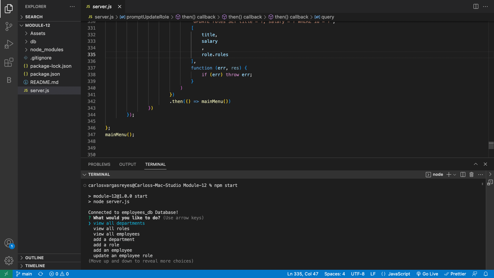
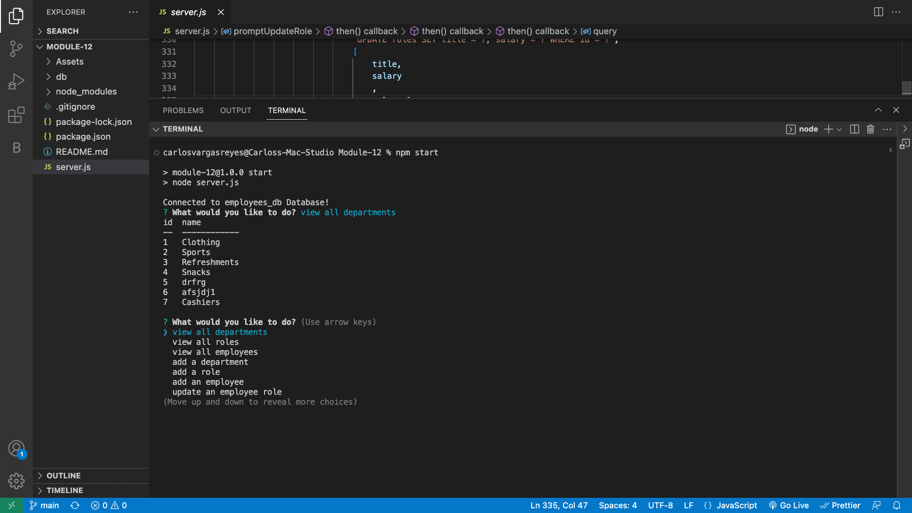
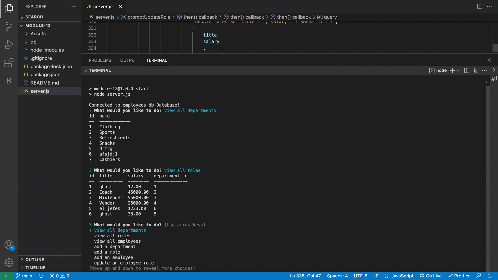
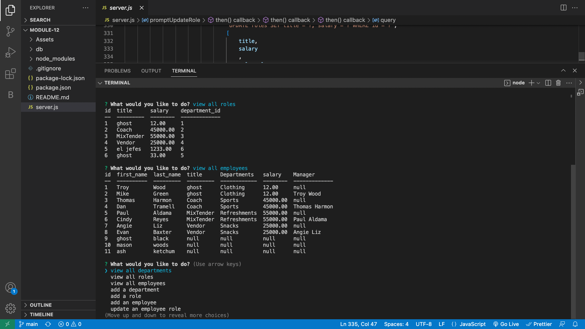
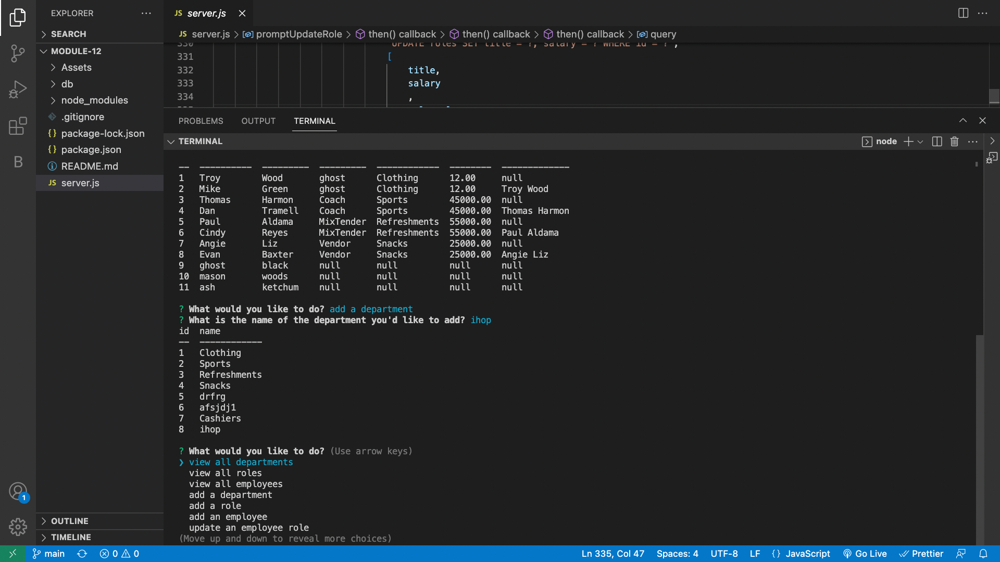

# My very own Employee Tracker
Carlos Employee Tracker development tool!

## Description
As a business man
I want to be able to view and manage the departments, roles, and employees in my company
So That I can organize and plan my business

## Acceptance Criteria
WHEN I start the application
THEN I am presented with the following options: view all departments, view all roles, view all employees, add a department, add a role, add an employee, and update an employee role
WHEN I choose to view all departments
THEN I am presented with a formatted table showing department names and department ids
WHEN I choose to view all roles
THEN I am presented with the job title, role id, the department that role belongs to, and the salary for that role
WHEN I choose to view all employees
THEN I am presented with a formatted table showing employee data, including employee ids, first names, last names, job titles, departments, salaries, and managers that the employees report to
WHEN I choose to add a department
THEN I am prompted to enter the name of the department and that department is added to the database
WHEN I choose to add a role
THEN I am prompted to enter the name, salary, and department for the role and that role is added to the database
WHEN I choose to add an employee
THEN I am prompted to enter the employee’s first name, last name, role, and manager, and that employee is added to the database

## Usage
To use my development tool, you will have to install all the packages, witch is already done for you.
Then you will have to type NPM start on the server and wah la. Make sure to have fun with it.

## Licence
MIT Licence

## Questions
My GitHub is CARLIYS, and my Email is carlosvargas3200@gmail.com

